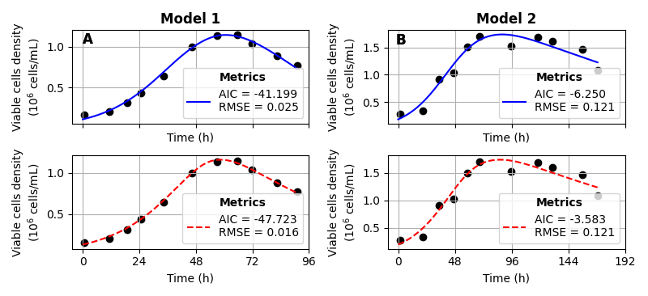
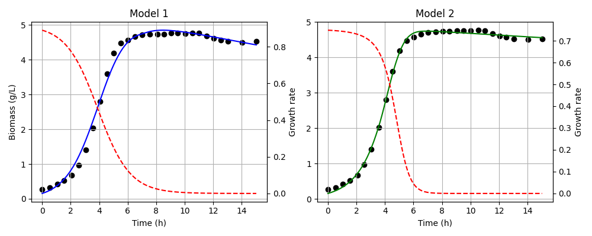

# Extended Logistic Growth Model
This Python code is associated to the submitted manuscript "A Single Population Approach to Modeling Growth and Decay in Batch Bioreactors", Carlos Matinez von Dossow, Marielle Péré.
It runs on Python 3.12 and uses Matplotlib, Scipy, NUmpy and Pandas libraries.

Its purpose is to calibrate the models presented in this paper to data from different studies on batch culture.
It organizes data from 6 different papers:
 * Ljumggren, 1994 (from Goudar, 2005),
 * Linz, 1997 (from Goudar, 2005),
 * Bayley, 2012,
 * Wright, 2009,
 * Torres, 2020,
 * Amrane, 1998,
and presents the corresponding calibration of model M1 and M2 results.

Therefore two figures are generated:
 * Figure 3 and 4 of the paper 
  

 
The code is organized in three parts: Import, Functions and Main with a function per figure named accordingly. 
